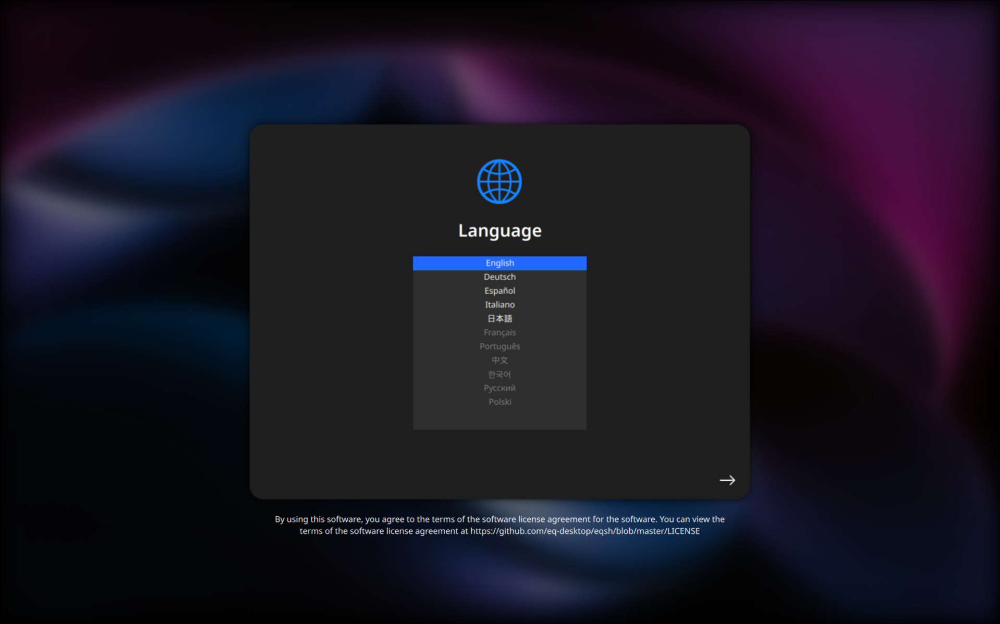
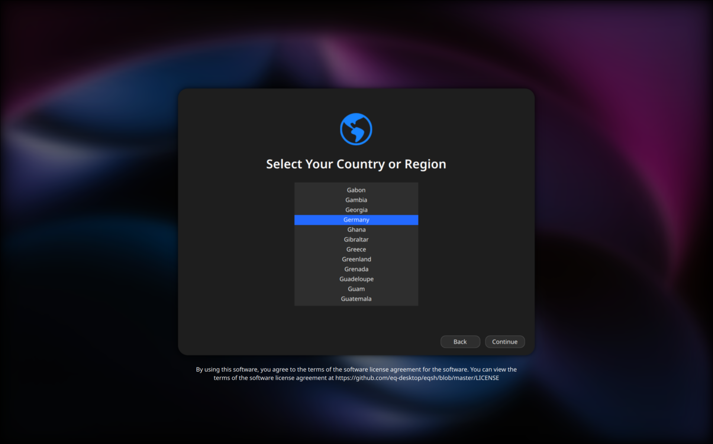

# Equora Welcome

**Equora Welcome** is the lightweight post-install setup window for the Equora desktop.  
It helps new users quickly configure essential settings and get started.

## Features
- First-time setup made simple  
- Language and region selection  
- Account and personalization options  
- Links to documentation

## Screenshots





## Usage
Equora Welcome runs automatically after installation.  
You can also launch it manually with:

```bash
equora-welcome
```

Which will output an `output.json` file

## License

Licensed under the [Apache 2.0 License](LICENSE).